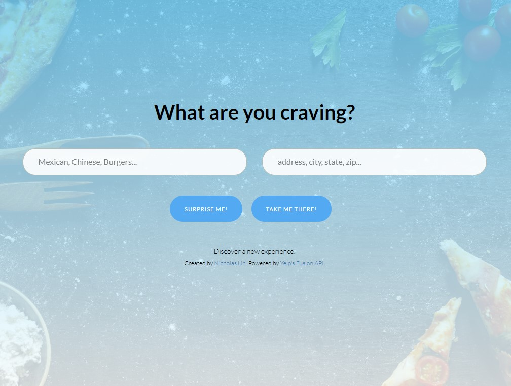
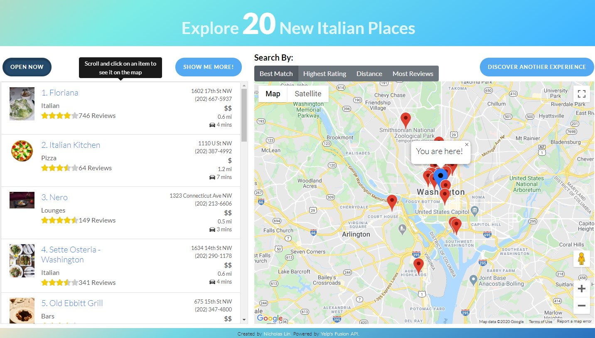

    
  </a>

  <h3 align="center">Software Engineering Summit 2020 Challenge</h3>

# Capital One Summit 2020 Challenge Winner

## Description
## [Visit the website here!](hhttps://nicholas-lin.github.io/Capital-One-Summit/)

 
 

This is a web application using Yelp's Fusion API to help users pick a restaurant or experience. The app obtains user location via HTML5 Geolocation and plots merchants on a map based on search terms and search rules.

## Design

### Requirements
* Deployed web application
* Uses Yelp's Fusion API
* Plot merchants on a map
* Obtain user location via HTML5 Geolocation
### Additional Features
* Users can refine a search by different parameters (open now, best match, rating, etc.)
* Users recieve information about the distance in miles and time to reach a business
* Users can request more businesses
* Users can select an item from the list to view its location on the map and the route to get there
* Users can view the Yelp page for a merchant by clicking on the title of the business from the list or a map marker
### Notes
*  The Yelp API has [daily access limiting](https://www.yelp.com/developers) as well as [queries-per-second limiting](https://www.yelp.com/developers/documentation/v3/qps_rate_limiting). In some circumstances, these limits may lead to HTTP 429 errors, resulting in loss of core functionality.

## Built With
* HTML/CSS/JavaScript
* Bootstrap
* JQuery/Axios
* [Yelp's Fusion API ](https://www.yelp.com/developers)
* [Google Maps Platform](https://developers.google.com/maps/documentation)

## What I learned
Before working on this project, I had never wrote a single line of HTML or CSS and I had very little experience in Javascript. I had originally planned on building my first website over the summer, but now time was no longer a luxury. I found the challenge to be overwhelming - I had never done anything close to building a website, and had no clue where to even begin.  After going through the requirements and spending days trying to learn a framework such as React and Vue.js, I made little to no progress and considered not pursuing the challenge.

I decided to go back to basics with vanilla Javascript. As soon as I did this, I started making measurable progress. Although JS frameworks/libraries can be extremely powerful and help clean up code, I found that they abstracted away a lot of code, which made it difficult for me to understand what was happening behind the scenes. This is why I used vanilla Javascript with  JQuery and Axios for modifying HTML and making API requests respectively.

This challenge was an amazing opportunity that made me really push myself to see what I could accomplish with a fundamental understanding of CS in a two week time frame. I have learned so much from working with these different languages, and I still have a long way to go as a developer. Overall this challenge was very fun and I enjoyed working on this project - thank you!

## Author
Hello, my name is Nicholas Lin and I am a first-year computer science study in the School of Engineering at UVA. If you have any questions or suggestions for improvement, feel free to email me at [nicholaslin@email.virginia.edu](mailto:nicholaslin@email.virginia.edu).
